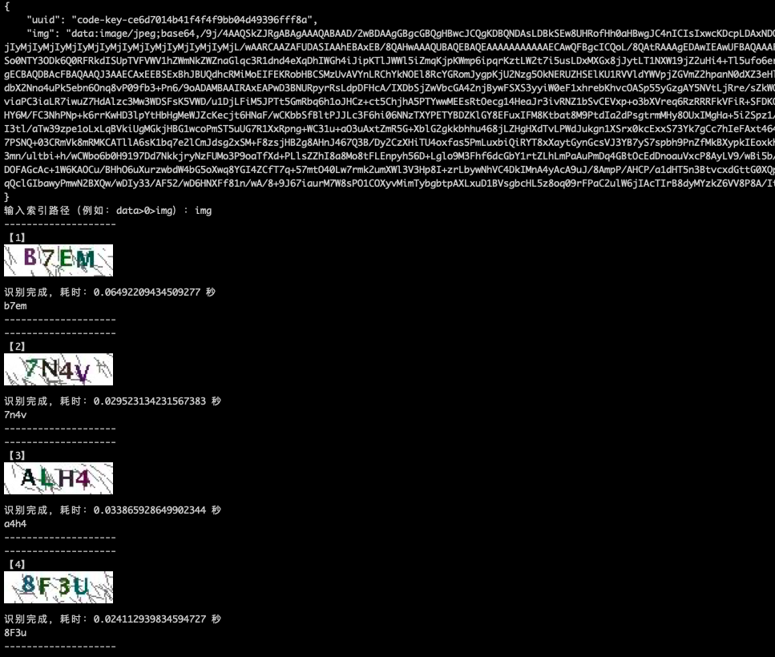

# verification_code_ocr_test
图形验证码容易被OCR识别验证脚本

运行时会自动尝试安装 ddddocr 库，担心污染本地环境的建议新建虚拟环境运行

例：
```
.venv/bin/python verification_code_ocr_test.py <url>
```

识别结果会输出终端，图片会以识别出的字符串命名成png后缀文件保存在当前目录下

```
ps: 在Iterm2上支持在终端显示图片，yyds
```

